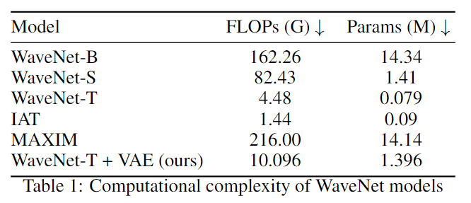
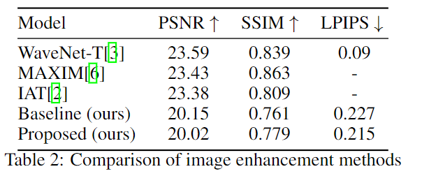
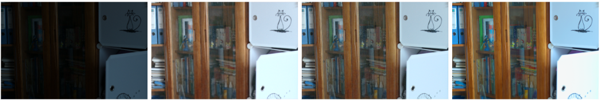
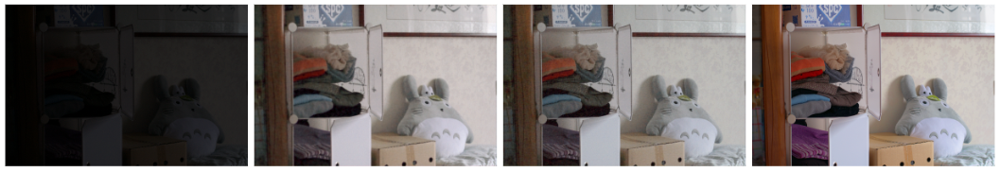

# Enhancing Dark Photos

## [Aashish Bhole]

> **Abstract:** In this research, we tackle the persistent problem of dark and underexposed photos, which can be challenging in fields like photography and computer vision. We explore the use of advanced computer techniques, like GANs, to make these pictures brighter and clearer. Our approach not only addresses the limitations of existing methods but also enhances the quality of the recovered images, making them look better and more useful. This has broad applications, from improving object detection in low light to making photography work well in extremely dark situations. 
<hr />


## Installation

See [INSTALL.md](INSTALL.md) for the installation of dependencies required to run WaveNet.

## Quick Run (Demo) 

Test on the local environment:  

To test the pre-trained models for enhancing your images, run
```
cd basicsr

python demo.py --input_dir images_folder_path --result_dir save_images_here --weights path_to_models
```
**All pre-trained models can be found in the folder "checkpoints/<$dataset$>"

## Train  
Training for Image Enhancement is provided in <a href="basicsr/TRAINING.md">TRAINING.md</a></td>.

## Dataset
For the preparation of dataset, see [dataset/README.md](dataset/README.md).  

## Test (Evaluation)  
 
- To test the PSNR, SSIM and LPIPS of *image enhancement*, see [evaluation.py](./evaluation.py) and run
```
cd basicsr

python evaluation.py -dirA images_folder_path -dirB images_folder_path -type image_data_type --use_gpu use_gpu_or_not
```

## Result  

<details close>
<summary><b>Quantitative Evaluation on LOL dataset.</b></summary>


 


</details>  

<details close>
<summary><b>Qualitative Evaluation on LOL dataset.</b></summary>


Sample Input1, Baseline, Proposed Model, Ground truth

Sample Input2, Baseline, Proposed Model, Ground truth
</details>

## Contact
Should you have any questions, please contact abhole@ucsd.edu


**Acknowledgment:** This code is based on the [WaveNet](https://github.com/DeniJsonC/WaveNet) github repository for the paper WaveNet: Wave-Aware Image Enhancement [](https://diglib.eg.org/bitstream/handle/10.2312/pg20231267/021-029.pdf). 